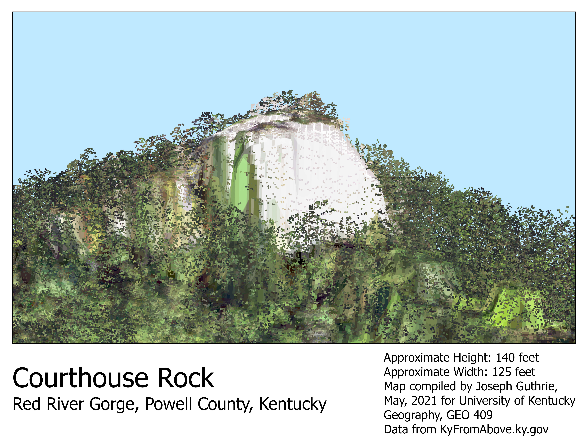
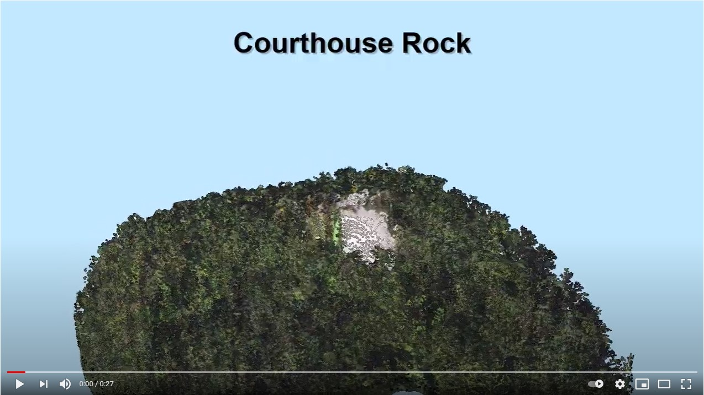

# JAGPortfolio
## Joseph Guthrie GEO 409 Final Portfolio

[https://josephaguthrie.github.io/JAGPortfolio/](https://josephaguthrie.github.io/JAGPortfolio/)

## Summary

My Final Portfolio Explores several areas in Kentucky that I like from the Red River Gorge, High Bridge, Wolf Creek Dam, to the Pinnacle Fire Tower near Cumberland Falls State Park.

I really like Cesium Ion, the web hosting of the 3D point clouds.  I see the value of MapBox and it's 2D maps which I will continue top use for some personal maps but Cesium Ion is definitely something that I am going to continue to use for my personal maps and models and definitely something I will use for work.

Thanks for a great semester and for being so accommodating with my computer troubles.  This was by FAR my favorite class this semester and I am looking into getting a Geography minor now.

## Mapbox Link

[Link to Mapbox](sitemap/index.html)

## Cesium Ion Link

[Link to Cesium Ion Presentation](https://cesium.com/ion/stories/viewer/?id=5deddd77-6ad9-427c-886d-ff1eb8c23163)

## Courthouse Rock in the Red River Gorge

## Animation of Courthouse Rock in the Red River Gorge

[Youtube link of Courthouse Rock Animation](https://youtu.be/G72U5XA_0WY)